# AvatarConnect: Elevating Customer Engagement with Lifelike AI Experiences - Hackathon Specification

## Title

Delivering Humanlike Interactions Through AI-Powered Avatars

## Tagline

Revolutionizing Customer Experience with Lifelike, Interactive AI Avatars

## Keywords

Azure TTS Avatar, Azure OpenAI, Agentic Architecture, Customer Experience, Multimodal AI, Real-time Interaction, Accessibility, Sentiment Analysis, Coffee Shop, Booth Engagement

## Description

Transform customer engagement with customizable avatars, real-time expressive speech, and automated video generation. Integrates Azure TTS Avatar, Azure OpenAI, and agentic workflows to deliver personalized, accessible, and memorable experiences for every visitor. Avatars answer questions, provide tailored information, and create lasting impressions—especially in high-traffic environments like coffee shop booths.

## Executive Challenge

**Executive Challenge: Hack for Customer Experience through AI**

Demonstrate how AI avatars can revolutionize customer engagement, accessibility, and personalization in real-world business settings.

## Problem or Opportunity Statement

It's hard to give every booth visitor personalized attention. Our lifelike AI avatars deliver dynamic, tailored interactions and answers, transforming customer engagement and accessibility for all.

## Topic Challenges

- AI for Customer Service
- Accessibility & Inclusion
- Real-time Multimodal Interaction
- Agentic Workflows & Autonomous Agents
- Azure AI Integration

## Project Description

Revolutionizing Customer Experience: Transforming customer engagement with Azure TTS Avatar, Azure OpenAI, and Agentic Architecture. This project features lifelike, customizable avatars with diverse looks and voices, automated video generation via API (including batch support), and real-time, expressive speech with adjustable styles and emotions. Integration is simple and works seamlessly with other Azure services, offering pay-as-you-go pricing and accessibility improvements for users with disabilities.

Key benefits include:

- Personalized, dynamic interaction for every booth visitor—even during peak times
- Unique, engaging experiences that differentiate your coffee shop from competitors
- Tangible, interactive demonstration of AI solving real-world problems
- Avatars answer a wide range of questions about products and services, providing tailored information
- The novelty and interactivity of conversing with an AI avatar leaves a lasting impression

Refer to the README.md for technical features, stack, and setup instructions.

## Project Overview

**Project Name**: Delivering Humanlike Interactions Through AI-Powered Avatars

**Vision**: Create an intelligent, multilingual AI avatar system that provides personalized customer interactions with sentiment analysis, voice/tele agent capabilities, and contextual understanding using Azure services and agentic architecture.

## 1. Requirements Specification

### 1.1 Functional Requirements

#### Core Features

- **AI Avatar Interface**: Lifelike avatar with customizable appearance and natural speech
- **Multi-modal Interaction**: Support for voice input, text chat, and video responses
- **Multilingual Support**: Real-time language detection and response in 40+ languages
- **Sentiment Analysis**: Real-time emotion detection and adaptive response tone
- **Voice/Tele Agent**: Phone integration for traditional customer service channels
- **Order Processing**: End-to-end order management with backend system integration
- **Contextual Understanding**: RAG-powered knowledge base querying
- **Accessibility**: Screen reader support, high contrast modes, and voice navigation

#### Agentic Capabilities

- **Dynamic Tool Selection**: Autonomous decision-making for tool/API usage
- **Parallel Function Calling**: Simultaneous execution of multiple tasks
- **Memory Management**: Persistent conversation history and context retention
- **Workflow Orchestration**: Multi-step process automation using LangGraph
- **Real-time Data Integration**: Live information retrieval and processing

#### Business Logic

- **Customer Profiling**: Dynamic user preference learning and adaptation
- **Product Recommendations**: AI-driven suggestion engine
- **Escalation Management**: Seamless handoff to human agents when needed
- **Analytics Dashboard**: Real-time interaction metrics and insights

### 1.2 Non-Functional Requirements

#### Performance

- **Response Time**: < 2 seconds for voice responses, < 1 second for text
- **Concurrent Users**: Support for 1000+ simultaneous connections
- **Availability**: 99.9% uptime with auto-scaling capabilities
- **Latency**: < 500ms for speech-to-text and text-to-speech processing

#### Security & Compliance

- **Data Encryption**: End-to-end encryption for all communications
- **Privacy**: GDPR/CCPA compliant data handling
- **Authentication**: OAuth 2.0 and Azure AD integration
- **Audit Logging**: Comprehensive activity tracking

#### Scalability

- **Horizontal Scaling**: Microservices architecture with container orchestration
- **Load Balancing**: Intelligent traffic distribution
- **Resource Optimization**: Dynamic scaling based on demand patterns

## 2. System Architecture

### 2.1 Solution Architecture Diagram

```mermaid
graph TB
    User[👤 User] --> Frontend[🖥️ Frontend Application<br/>React + TypeScript]

    subgraph "Client Layer"
        Frontend --> Avatar[🎭 Avatar Renderer<br/>Azure TTS Avatar SDK]
        Frontend --> Audio[🎤 Audio Manager<br/>Speech Recognition]
        Frontend --> UI[📱 UI Components<br/>Responsive Interface]
    end

    Frontend <-->|WebSocket| Gateway[🚪 API Gateway<br/>Express.js + Socket.io]

    subgraph "API Layer"
        Gateway --> Auth[🔐 Authentication<br/>Azure AD]
        Gateway --> Sentiment[😊 Sentiment Analysis<br/>Text Analytics API]
        Gateway --> Avatar_Service[🎬 Avatar Service<br/>TTS Integration]
    end

    Gateway <-->|HTTP/WS| Backend[⚙️ Backend Services<br/>Node.js + Express]

    subgraph "Intelligence Layer"
        Backend --> Agent[🤖 LangGraph Agent<br/>Agentic Workflows]
        Agent --> Tools[🛠️ Tool Orchestra<br/>Function Calling]
        Tools --> Search[🔍 Bing Search Tool]
        Tools --> Order[📋 Order Management]
        Tools --> KB[📚 Knowledge Base Tool]
        Tools --> Escalation[📞 Escalation Tool]
    end

    subgraph "Azure AI Services"
        Speech[🗣️ Azure Speech<br/>STT/TTS]
        OpenAI[🧠 Azure OpenAI<br/>GPT-4o]
        TextAnalytics[📊 Text Analytics<br/>Sentiment/Language]
        Translator[🌍 Translator<br/>Multi-language]
    end

    subgraph "Data Layer"
        CosmosDB[(🗄️ Cosmos DB<br/>Conversation History)]
        AISearch[(🔎 AI Search<br/>Vector Store/RAG)]
        Redis[(⚡ Redis Cache<br/>Session Management)]
        Analytics[(📈 Analytics Store<br/>Metrics & Insights)]
    end

    subgraph "External Systems"
        Phone[📞 Telephony<br/>Voice Agent]
        OrderSystem[🛒 Order System<br/>Backend Integration]
        CRM[👥 CRM System<br/>Customer Data]
    end

    Agent --> Speech
    Agent --> OpenAI
    Agent --> TextAnalytics
    Agent --> Translator

    Backend --> CosmosDB
    Backend --> AISearch
    Backend --> Redis
    Backend --> Analytics

    Tools --> Phone
    Tools --> OrderSystem
    Tools --> CRM

    classDef userLayer fill:#e1f5fe
    classDef clientLayer fill:#f3e5f5
    classDef apiLayer fill:#e8f5e8
    classDef intelligenceLayer fill:#fff3e0
    classDef azureLayer fill:#e3f2fd
    classDef dataLayer fill:#fce4ec
    classDef externalLayer fill:#f1f8e9

    class User userLayer
    class Frontend,Avatar,Audio,UI clientLayer
    class Gateway,Auth,Sentiment,Avatar_Service apiLayer
    class Backend,Agent,Tools,Search,Order,KB,Escalation intelligenceLayer
    class Speech,OpenAI,TextAnalytics,Translator azureLayer
    class CosmosDB,AISearch,Redis,Analytics dataLayer
    class Phone,OrderSystem,CRM externalLayer
```



### 2.2 Agentic Workflow Diagram

```mermaid
sequenceDiagram
    participant User as 👤 User
    participant Frontend as 🖥️ Frontend
    participant Agent as 🤖 LangGraph Agent
    participant LLM as 🧠 Azure OpenAI
    participant Tools as 🛠️ Tools
    participant DB as 🗄️ Database

    User->>Frontend: Voice/Text Input
    Frontend->>Agent: Process Request

    Agent->>DB: Retrieve Context
    DB-->>Agent: Conversation History

    Agent->>LLM: Generate Response Plan
    Note over Agent,LLM: System Prompt + Context + Tools

    LLM-->>Agent: Tool Selection & Args

    loop Tool Execution
        Agent->>Tools: Execute Tool
        Tools-->>Agent: Tool Results
        Agent->>LLM: Update Context
        LLM-->>Agent: Next Action
    end

    Agent->>DB: Store Context
    Agent-->>Frontend: Final Response
    Frontend-->>User: Avatar Response
```



### 2.3 Data Flow Architecture

```mermaid
flowchart LR
    subgraph "Input Processing"
        A[🎤 Voice Input] --> B[🔊 Speech-to-Text]
        C[💬 Text Input] --> D[📝 Text Processing]
        B --> E[🧹 Input Normalization]
        D --> E
    end

    subgraph "Intelligence Processing"
        E --> F[😊 Sentiment Analysis]
        E --> G[🌍 Language Detection]
        F --> H[🤖 LangGraph Agent]
        G --> H
        H --> I[🧠 GPT-4o Processing]
        I --> J[🛠️ Tool Selection]
        J --> K[⚡ Parallel Execution]
    end

    subgraph "Tool Ecosystem"
        K --> L[🔍 Knowledge Search]
        K --> M[📋 Order Management]
        K --> N[📞 Escalation Handler]
        K --> O[🏷️ Product Catalog]
        L --> P[📚 RAG Results]
        M --> Q[🛒 Order Status]
        N --> R[👨‍💼 Human Agent]
        O --> S[🏷️ Product Info]
    end

    subgraph "Response Generation"
        P --> T[📝 Response Synthesis]
        Q --> T
        R --> T
        S --> T
        T --> U[🗣️ Text-to-Speech]
        T --> V[🎭 Avatar Animation]
        U --> W[🔊 Audio Output]
        V --> W
    end

    subgraph "Memory & Learning"
        T --> X[🧠 Context Storage]
        X --> Y[📊 Analytics Update]
        Y --> Z[🎯 Personalization]
        Z --> H
    end
```



### 2.4 Microservices Architecture

```mermaid
graph TB
    subgraph "Frontend Tier"
        WebApp[🌐 Web Application<br/>React + TypeScript]
        Mobile[📱 Mobile App<br/>React Native]
        Phone[📞 Phone Interface<br/>Telephony Integration]
    end

    subgraph "API Gateway Layer"
        Gateway[🚪 API Gateway<br/>Rate Limiting, Auth, Routing]
        LoadBalancer[⚖️ Load Balancer<br/>Traffic Distribution]
    end

    subgraph "Microservices"
        AuthService[🔐 Auth Service<br/>User Management]
        AvatarService[🎭 Avatar Service<br/>TTS Avatar Management]
        ConversationService[💬 Conversation Service<br/>Chat Management]
        AgentService[🤖 Agent Service<br/>LangGraph Orchestration]
        AnalyticsService[📊 Analytics Service<br/>Metrics & Insights]
        NotificationService[🔔 Notification Service<br/>Real-time Updates]
    end

    subgraph "Data Services"
        UserDB[(👤 User Database<br/>Cosmos DB)]
        ConversationDB[(💬 Conversation Store<br/>Cosmos DB)]
        VectorDB[(🔎 Vector Database<br/>AI Search)]
        CacheLayer[(⚡ Cache Layer<br/>Redis)]
        FileStorage[(📁 File Storage<br/>Blob Storage)]
    end

    subgraph "External APIs"
        AzureAI[🧠 Azure AI Services]
        OpenAI[🤖 Azure OpenAI]
        BingSearch[🔍 Bing Search API]
        OrderAPI[🛒 Order Management API]
        CRMAPI[👥 CRM Integration]
    end

    WebApp --> Gateway
    Mobile --> Gateway
    Phone --> Gateway

    Gateway --> LoadBalancer
    LoadBalancer --> AuthService
    LoadBalancer --> AvatarService
    LoadBalancer --> ConversationService
    LoadBalancer --> AgentService
    LoadBalancer --> AnalyticsService
    LoadBalancer --> NotificationService

    AuthService --> UserDB
    AvatarService --> FileStorage
    ConversationService --> ConversationDB
    AgentService --> VectorDB
    AnalyticsService --> CacheLayer

    AgentService --> AzureAI
    AgentService --> OpenAI
    AgentService --> BingSearch
    AgentService --> OrderAPI
    AgentService --> CRMAPI

    classDef frontend fill:#e1f5fe
    classDef gateway fill:#f3e5f5
    classDef microservice fill:#e8f5e8
    classDef database fill:#fce4ec
    classDef external fill:#f1f8e9

    class WebApp,Mobile,Phone frontend
    class Gateway,LoadBalancer gateway
    class AuthService,AvatarService,ConversationService,AgentService,AnalyticsService,NotificationService microservice
    class UserDB,ConversationDB,VectorDB,CacheLayer,FileStorage database
    class AzureAI,OpenAI,BingSearch,OrderAPI,CRMAPI external
```



### 2.5 Deployment Architecture

```mermaid
graph TB
    subgraph "Azure Regions"
        subgraph "Primary Region (East US)"
            subgraph "Container Apps"
                FrontendApp[🌐 Frontend App<br/>Static Web App]
                APIApp[🚪 API Service<br/>Container App]
                AgentApp[🤖 Agent Service<br/>Container App]
                AnalyticsApp[📊 Analytics Service<br/>Container App]
            end

            subgraph "Data Services"
                PrimaryDB[(🗄️ Cosmos DB<br/>Primary)]
                PrimarySearch[(🔎 AI Search<br/>Primary)]
                PrimaryCache[(⚡ Redis Cache<br/>Primary)]
            end

            subgraph "AI Services"
                SpeechService[🗣️ Speech Services]
                OpenAIService[🧠 OpenAI Service]
                TextService[📊 Text Analytics]
            end
        end

        subgraph "Secondary Region (West US)"
            subgraph "Backup Services"
                BackupDB[(🗄️ Cosmos DB<br/>Replica)]
                BackupSearch[(🔎 AI Search<br/>Replica)]
                BackupCache[(⚡ Redis Cache<br/>Replica)]
            end
        end
    end

    subgraph "Global Services"
        CDN[🌍 Azure CDN<br/>Global Distribution]
        DNS[🌐 Azure DNS<br/>Traffic Management]
        Monitor[📊 Azure Monitor<br/>Observability]
    end

    subgraph "External Integrations"
        Telephony[📞 Telephony Provider]
        OrderSystems[🛒 Order Management]
        CRM[👥 CRM Systems]
    end

    CDN --> FrontendApp
    DNS --> CDN

    APIApp --> PrimaryDB
    APIApp --> PrimarySearch
    APIApp --> PrimaryCache

    AgentApp --> SpeechService
    AgentApp --> OpenAIService
    AgentApp --> TextService

    PrimaryDB -.->|Replication| BackupDB
    PrimarySearch -.->|Backup| BackupSearch
    PrimaryCache -.->|Backup| BackupCache

    AgentApp --> Telephony
    AgentApp --> OrderSystems
    AgentApp --> CRM

    Monitor --> FrontendApp
    Monitor --> APIApp
    Monitor --> AgentApp
    Monitor --> AnalyticsApp

    classDef primary fill:#e3f2fd
    classDef secondary fill:#f3e5f5
    classDef global fill:#e8f5e8
    classDef external fill:#f1f8e9

    class FrontendApp,APIApp,AgentApp,AnalyticsApp,PrimaryDB,PrimarySearch,PrimaryCache,SpeechService,OpenAIService,TextService primary
    class BackupDB,BackupSearch,BackupCache secondary
    class CDN,DNS,Monitor global
    class Telephony,OrderSystems,CRM external
```



### 2.6 Component Architecture

- **Avatar Renderer**: Real-time avatar animation and lip-sync
- **Audio Manager**: Speech recognition and audio processing
- **UI Components**: Responsive interface with accessibility features
- **State Management**: Redux/Zustand for application state

#### API Layer

- **Authentication Service**: User management and session handling
- **Avatar Service**: TTS Avatar integration and video streaming
- **Agent Service**: LangGraph agent orchestration
- **Analytics Service**: User interaction tracking and metrics

#### Backend Services

- **Conversation Engine**: LangGraph-powered agentic workflows
- **Knowledge Base**: RAG implementation with vector embeddings
- **Sentiment Engine**: Real-time emotion analysis
- **Integration Hub**: External API and service connectors

#### Data Layer

- **Conversation Store**: MongoDB for chat history and context
- **Vector Database**: Azure AI Search for RAG implementation
- **Cache Layer**: Redis for session management and performance
- **Analytics Store**: Time-series database for metrics

## 3. Technology Stack Options

### Option 1: Azure-Native Stack (Recommended)

| Component            | Technology                    | Justification                      |
| -------------------- | ----------------------------- | ---------------------------------- |
| **Frontend**         | React 18 + TypeScript + Vite  | Modern, performant, type-safe      |
| **UI Library**       | Chakra UI + Framer Motion     | Accessible components + animations |
| **State Management** | Zustand                       | Lightweight, TypeScript-first      |
| **Avatar SDK**       | Azure TTS Avatar SDK          | Native Azure integration           |
| **Speech Services**  | Azure Cognitive Services      | Best-in-class speech recognition   |
| **Backend Runtime**  | Node.js 20 + Express.js       | TypeScript ecosystem compatibility |
| **Agent Framework**  | LangGraph + LangChain         | Advanced agentic workflows         |
| **LLM Service**      | Azure OpenAI GPT-4o           | Latest model with function calling |
| **Database**         | Azure Cosmos DB (MongoDB API) | Globally distributed, scalable     |
| **Vector Store**     | Azure AI Search               | Integrated RAG capabilities        |
| **Cache**            | Azure Cache for Redis         | High-performance caching           |
| **Hosting**          | Azure Container Apps          | Serverless containers              |
| **Real-time**        | Socket.io + Azure SignalR     | WebSocket scaling                  |
| **Monitoring**       | Azure Monitor + App Insights  | Comprehensive observability        |

### Option 2: Multi-Cloud Hybrid Stack

| Component            | Technology               | Justification                    |
| -------------------- | ------------------------ | -------------------------------- |
| **Frontend**         | Next.js 14 + TypeScript  | Full-stack React framework       |
| **UI Library**       | shadcn/ui + Tailwind CSS | Modern design system             |
| **State Management** | TanStack Query + Jotai   | Server state + atomic state      |
| **Avatar SDK**       | Azure TTS Avatar SDK     | Core avatar functionality        |
| **Speech Services**  | Azure Cognitive Services | Primary speech processing        |
| **Backend Runtime**  | Node.js + Fastify        | High-performance HTTP server     |
| **Agent Framework**  | LangGraph + Custom Tools | Flexible agent architecture      |
| **LLM Service**      | Azure OpenAI + Anthropic | Multi-provider approach          |
| **Database**         | PostgreSQL + Prisma ORM  | Relational data with type safety |
| **Vector Store**     | Pinecone                 | Specialized vector database      |
| **Cache**            | Upstash Redis            | Serverless Redis                 |
| **Hosting**          | Vercel + Railway         | Modern deployment platforms      |
| **Real-time**        | Pusher Channels          | Managed WebSocket service        |
| **Monitoring**       | Datadog                  | Advanced APM and logging         |

### Option 3: Open-Source First Stack

| Component            | Technology                  | Justification                      |
| -------------------- | --------------------------- | ---------------------------------- |
| **Frontend**         | SvelteKit + TypeScript      | Lightweight, compiled framework    |
| **UI Library**       | Skeleton UI + SCSS          | Svelte-native components           |
| **State Management** | Svelte Stores               | Built-in reactive state            |
| **Avatar SDK**       | Azure TTS Avatar SDK        | Required for avatar functionality  |
| **Speech Services**  | Azure Cognitive Services    | Best available option              |
| **Backend Runtime**  | Deno 2 + Hono               | Modern runtime + framework         |
| **Agent Framework**  | LangGraph + Ollama          | Local LLM capabilities             |
| **LLM Service**      | Azure OpenAI + Local Models | Hybrid approach                    |
| **Database**         | Supabase (PostgreSQL)       | Open-source Firebase alternative   |
| **Vector Store**     | Qdrant                      | Open-source vector database        |
| **Cache**            | KeyDB                       | Redis-compatible, faster           |
| **Hosting**          | Self-hosted + Docker        | Full control and cost optimization |
| **Real-time**        | WebSocket (native)          | Built-in real-time capabilities    |
| **Monitoring**       | Grafana + Prometheus        | Open-source observability          |

## 4. 5-Day Development Plan

| Day | Component Area       | Summary of Work Needed                                   | Owners | Team Alignment/Ownership | PM/EM | Agreement Status |
| --- | -------------------- | -------------------------------------------------------- | ------ | ------------------------ | ----- | ---------------- |
| 1   | Frontend UI          | Build React UI, setup layout                             |        |                          |       |                  |
| 1   | TTS Avatar Component | Develop TTS avatar, integrate Azure Speech SDK           |        |                          |       |                  |
| 2   | Backend API          | Develop Express.js API, enable WebSocket, connect Azure  |        |                          |       |                  |
| 3   | Agentic Workflows    | Implement LangChain/LangGraph agent, add sentiment/RAG   |        |                          |       |                  |
| 4   | Multimodal Features  | Add speech-to-text, video, multi-language, accessibility |        |                          |       |                  |
| 5   | Analytics & Final QA | Build dashboard, optimize, test, document, deploy        |        |                          |       |                  |

_Add developer names and ownership details in the table above as assignments are made._

## Component Work/Tasks Breakdown

| Component            | Work Needed                                                                                                                                                                              | Priority | Owners        | Notes |
| -------------------- | ---------------------------------------------------------------------------------------------------------------------------------------------------------------------------------------- | -------- | ------------- | ----- |
| Frontend UI          | - Build responsive layout and navigation<br>- Integrate shadcn/ui and Tailwind CSS<br>- Implement main dashboard and settings pages                                                      | High     | Deepak Kamboj |       |
| TTS Avatar Component | - Develop avatar UI component<br>- Integrate Azure Speech SDK for TTS<br>- Support avatar customization (appearance, voice)<br>- Handle real-time speech and animation                   | High     |               |       |
| Backend API          | - Create REST endpoints for chat, models, grab<br>- Implement WebSocket for real-time features<br>- Connect to Azure services (OpenAI, TTS)<br>- Ensure secure API access                | High     |               |       |
| Agentic Workflows    | - Integrate LangChain/LangGraph agent<br>- Add sentiment analysis and RAG<br>- Enable parallel tool/function calling<br>- Persist conversation history                                   | Medium   | Deepak Kamboj |       |
| Multimodal Features  | - Add speech-to-text and video support<br>- Enable multi-language responses<br>- Implement accessibility features (a11y)<br>- Support custom backgrounds                                 | Medium   |               |       |
| Analytics & QA       | - Build analytics dashboard<br>- Optimize performance and reliability<br>- Conduct testing and QA<br>- Write documentation and deploy<br>- Create Hackathon demo, presentation and video | Medium   |               |       |

_Fill in Owners and Notes as assignments are made._

## 5. Key Features Implementation

### 5.1 Sentiment Analysis Pipeline

```typescript
interface SentimentAnalysis {
  emotion: 'positive' | 'negative' | 'neutral' | 'frustrated' | 'excited';
  confidence: number;
  suggestions: string[];
  escalationRequired: boolean;
}
```

### 5.2 Agentic Workflow Example

```typescript
const customerServiceAgent = new LangGraphAgent({
  tools: [
    new ProductSearchTool(),
    new OrderManagementTool(),
    new EscalationTool(),
    new SentimentAnalysisTool(),
  ],
  memory: new ConversationBufferWindowMemory(),
  llm: new AzureOpenAI({ model: 'gpt-4o' }),
});
```

### 5.3 Multi-modal Integration

```typescript
interface InteractionChannel {
  voice: VoiceRecognition;
  text: TextInput;
  avatar: AvatarRenderer;
  phone: TelephonyIntegration;
}
```

## 6. Success Metrics

### Technical Metrics

- **Response Time**: < 2 seconds average
- **Accuracy**: > 95% intent recognition
- **Uptime**: 99.9% availability
- **Scalability**: 1000+ concurrent users

### Business Metrics

- **Customer Satisfaction**: > 4.5/5 rating
- **Resolution Rate**: > 80% first-contact resolution
- **Language Coverage**: 40+ languages supported
- **Accessibility Compliance**: WCAG 2.1 AA standard

## 7. Risk Mitigation

### Technical Risks

- **API Rate Limits**: Implement caching and request pooling
- **Avatar Performance**: Optimize video streaming and compression
- **Real-time Latency**: Use CDN and edge computing
- **LLM Reliability**: Implement fallback mechanisms

### Business Risks

- **Data Privacy**: Implement zero-retention policies for sensitive data
- **Bias in AI**: Regular model testing and bias detection
- **Accessibility**: Comprehensive testing with assistive technologies
- **Scalability**: Auto-scaling infrastructure planning

## 8. Learning Resources & Documentation

### 8.1 Azure TTS Avatar SDK

#### Official Documentation

- **Azure TTS Avatar Overview**: https://docs.microsoft.com/en-us/azure/cognitive-services/speech-service/text-to-speech-avatar/what-is-text-to-speech-avatar
- **TTS Avatar SDK Reference**: https://docs.microsoft.com/en-us/azure/cognitive-services/speech-service/text-to-speech-avatar/avatar-sdk-reference
- **JavaScript SDK Documentation**: https://docs.microsoft.com/en-us/javascript/api/microsoft-cognitiveservices-speech-sdk/
- **Avatar Customization Guide**: https://docs.microsoft.com/en-us/azure/cognitive-services/speech-service/text-to-speech-avatar/avatar-customization

#### Tutorials & Samples

- **Quick Start Guide**: https://docs.microsoft.com/en-us/azure/cognitive-services/speech-service/text-to-speech-avatar/avatar-quickstart
- **JavaScript Sample Code**: https://github.com/Azure-Samples/cognitive-services-speech-sdk/tree/master/samples/js/browser/avatar
- **Real-time Avatar Demo**: https://github.com/Azure-Samples/cognitive-services-speech-sdk/tree/master/samples/js/browser/avatar/realtime
- **Batch Avatar Processing**: https://docs.microsoft.com/en-us/azure/cognitive-services/speech-service/text-to-speech-avatar/batch-avatar-synthesis

#### Video Tutorials

- **Azure TTS Avatar Introduction**: https://www.youtube.com/watch?v=your-video-id
- **Building Interactive Avatars**: https://docs.microsoft.com/en-us/shows/ai-show/azure-text-to-speech-avatar
- **Microsoft Learn Path**: https://docs.microsoft.com/en-us/learn/paths/azure-speech-services/

### 8.2 Azure Cognitive Services

#### Speech Services

- **Speech SDK Overview**: https://docs.microsoft.com/en-us/azure/cognitive-services/speech-service/
- **Speech-to-Text Documentation**: https://docs.microsoft.com/en-us/azure/cognitive-services/speech-service/speech-to-text
- **Text-to-Speech Documentation**: https://docs.microsoft.com/en-us/azure/cognitive-services/speech-service/text-to-speech
- **JavaScript Speech SDK**: https://docs.microsoft.com/en-us/azure/cognitive-services/speech-service/quickstarts/setup-platform?pivots=programming-language-javascript

#### Language Understanding & AI

- **Azure OpenAI Service**: https://docs.microsoft.com/en-us/azure/cognitive-services/openai/
- **Language Understanding (LUIS)**: https://docs.microsoft.com/en-us/azure/cognitive-services/luis/
- **Text Analytics (Sentiment Analysis)**: https://docs.microsoft.com/en-us/azure/cognitive-services/text-analytics/
- **Translator Service**: https://docs.microsoft.com/en-us/azure/cognitive-services/translator/

#### Code Samples & SDKs

- **Cognitive Services Samples Repository**: https://github.com/Azure-Samples/cognitive-services-speech-sdk
- **JavaScript/TypeScript Examples**: https://github.com/Azure-Samples/cognitive-services-speech-sdk/tree/master/samples/js
- **REST API Reference**: https://docs.microsoft.com/en-us/rest/api/cognitiveservices/
- **NPM Packages**:
  - `microsoft-cognitiveservices-speech-sdk`
  - `@azure/cognitiveservices-textanalytics`
  - `@azure/cognitiveservices-luis-runtime`

### 8.3 LangChain & LangGraph Resources

#### Official Documentation

- **LangChain Documentation**: https://js.langchain.com/docs/
- **LangGraph Documentation**: https://langchain-ai.github.io/langgraph/
- **LangChain Agents**: https://js.langchain.com/docs/modules/agents/
- **Azure OpenAI Integration**: https://js.langchain.com/docs/integrations/llms/azure_openai

#### Tutorials & Guides

- **Building Agentic Workflows**: https://langchain-ai.github.io/langgraph/tutorials/introduction/
- **Tool Calling with LangGraph**: https://langchain-ai.github.io/langgraph/how-tos/tool-calling/
- **RAG Implementation**: https://js.langchain.com/docs/use_cases/question_answering/
- **Memory Management**: https://js.langchain.com/docs/modules/memory/

### 8.4 Additional Development Resources

#### Azure Development

- **Azure SDK for JavaScript**: https://docs.microsoft.com/en-us/javascript/api/overview/azure/
- **Azure Developer Documentation**: https://docs.microsoft.com/en-us/azure/developer/
- **Azure Samples**: https://github.com/Azure-Samples
- **Azure Architecture Center**: https://docs.microsoft.com/en-us/azure/architecture/

#### TypeScript & React

- **TypeScript Handbook**: https://www.typescriptlang.org/docs/
- **React Documentation**: https://react.dev/
- **Azure Static Web Apps**: https://docs.microsoft.com/en-us/azure/static-web-apps/
- **WebSocket Implementation**: https://developer.mozilla.org/en-US/docs/Web/API/WebSocket

### 8.5 Community & Support

#### Forums & Communities

- **Azure Cognitive Services Forum**: https://docs.microsoft.com/en-us/answers/topics/azure-cognitive-services.html
- **LangChain Discord**: https://discord.gg/langchain
- **Stack Overflow Tags**: `azure-cognitive-services`, `azure-speech`, `langchain`
- **Microsoft Tech Community**: https://techcommunity.microsoft.com/t5/azure-ai-services/bd-p/Azure-AI-Services

#### GitHub Repositories

- **Azure SDK for JavaScript**: https://github.com/Azure/azure-sdk-for-js
- **LangChain JS**: https://github.com/langchain-ai/langchainjs
- **Azure Samples**: https://github.com/Azure-Samples
- **Microsoft Cognitive Services**: https://github.com/microsoft/cognitive-services-speech-sdk-js

## 9. Getting Started

### Prerequisites

- Node.js 20+
- Azure subscription with OpenAI access
- TypeScript development environment
- Docker for local development

### Azure Services Setup

1. **Create Azure Cognitive Services Resource**
   - Follow: https://docs.microsoft.com/en-us/azure/cognitive-services/cognitive-services-apis-create-account
2. **Enable Azure OpenAI Service**
   - Apply for access: https://aka.ms/oai/access
3. **Configure TTS Avatar**
   - Follow setup guide: https://docs.microsoft.com/en-us/azure/cognitive-services/speech-service/text-to-speech-avatar/avatar-quickstart

### Quick Start Commands

```bash
# Clone and setup
git clone <repository>
cd ai-avatar-project
npm install

# Install Azure SDKs
npm install microsoft-cognitiveservices-speech-sdk
npm install @azure/cognitiveservices-textanalytics
npm install langchain @langchain/azure-openai

# Environment setup
cp .env.example .env
# Configure Azure keys and endpoints

# Development
npm run dev:frontend  # React development server
npm run dev:backend   # Express API server
npm run dev:agent     # LangGraph agent service

# Build and deploy
npm run build
npm run deploy:azure
```

### Environment Variables Template

```bash
# Azure Cognitive Services
AZURE_SPEECH_KEY=your_speech_key
AZURE_SPEECH_REGION=your_region
AZURE_OPENAI_KEY=your_openai_key
AZURE_OPENAI_ENDPOINT=your_openai_endpoint

# TTS Avatar
AZURE_AVATAR_ENDPOINT=your_avatar_endpoint
AZURE_AVATAR_KEY=your_avatar_key

# Database
COSMOS_DB_CONNECTION_STRING=your_cosmos_connection
AZURE_SEARCH_ENDPOINT=your_search_endpoint
AZURE_SEARCH_KEY=your_search_key
```

This specification provides a comprehensive foundation for building a sophisticated AI-powered avatar system that combines the latest in Azure AI services, agentic architecture, and modern web technologies.
