# AvatarConnect: Revolutionizing Customer Experience with AI-Powered Avatars


## 🎯 Hackathon 2025 Project

**Delivering Humanlike Interactions Through AI-Powered Avatars**

Transform customer engagement with customizable avatars, real-time expressive speech, and automated agentic workflows. This project integrates Azure TTS Avatar, AI SDK with multiple providers, and intelligent coffee ordering system to deliver personalized, accessible, and memorable customer experiences.

## 🚀 Features

### ✅ Implemented

- **🎭 AI Avatar Interface**: Lifelike avatar with Azure TTS integration and natural speech
- **🗣️ Multi-modal Interaction**: Voice input, text chat, and avatar responses
- **🤖 Agentic Workflows**: Intelligent tool selection and function calling
- **☕ Coffee Ordering System**: Complete CoffeeCorp integration with order management
- **💾 Persistent Storage**: SQLite database for order history and session management
- **🎨 Modern UI**: shadcn/ui components with dark/light theme support
- **📱 Responsive Design**: Mobile-first approach with Tailwind CSS
- **🔄 Real-time Updates**: Continuous speech recognition and seamless interactions

### 🔧 Technical Stack

- **Frontend**: Next.js 15, React 18, TypeScript
- **UI/UX**: shadcn/ui, Tailwind CSS, Framer Motion
- **State Management**: Jotai atomic state management
- **AI Integration**: Vercel AI SDK with multiple providers
- **Avatar Service**: Azure Speech API with Video Avatar
- **Database**: SQLite with sqlite3 for persistent storage
- **Speech Services**: Azure Cognitive Services (STT/TTS)

## 🏗️ System Architecture

```mermaid
graph TB
    User[👤 User] --> Frontend[🖥️ Next.js Frontend<br/>React + TypeScript]

    subgraph "Client Layer"
        Frontend --> Avatar[🎭 Avatar Component<br/>Azure TTS Avatar SDK]
        Frontend --> Audio[🎤 Audio Manager<br/>Speech Recognition]
        Frontend --> Chat[💬 Chat Interface<br/>Real-time Messaging]
    end

    Frontend --> API[🚪 API Routes<br/>Next.js API]

    subgraph "AI Layer"
        API --> AIProviders[🧠 AI Providers<br/>OpenAI, Anthropic, Groq, Mistral]
        API --> Tools[🛠️ Function Tools<br/>Coffee Ordering System]
        Tools --> Orders[☕ Order Management]
        Tools --> Weather[🌤️ Weather Info]
        Tools --> Company[🏢 Company Info]
    end

    subgraph "Data Layer"
        API --> SQLite[(🗄️ SQLite Database<br/>Orders & Sessions)]
        Orders --> SQLite
    end

    subgraph "Azure Services"
        Avatar --> Speech[🗣️ Azure Speech<br/>TTS/STT Services]
        Speech --> TTS[🔊 Text-to-Speech]
        Speech --> STT[🎤 Speech-to-Text]
    end

    classDef client fill:#e1f5fe
    classDef api fill:#f3e5f5
    classDef ai fill:#e8f5e8
    classDef data fill:#fce4ec
    classDef azure fill:#e3f2fd

    class User,Frontend,Avatar,Audio,Chat client
    class API api
    class AIProviders,Tools,Orders,Weather,Company ai
    class SQLite data
    class Speech,TTS,STT azure
```



## 🛠️ Current Technology Stack

Based on the actual implementation, here's our tech stack:

| Component              | Technology           | Version       | Purpose                                    |
| ---------------------- | -------------------- | ------------- | ------------------------------------------ |
| **Frontend Framework** | Next.js              | 15.0.3        | Full-stack React framework with App Router |
| **UI Library**         | shadcn/ui + Radix UI | Latest        | Accessible, customizable components        |
| **Styling**            | Tailwind CSS         | ^3.4.15       | Utility-first CSS framework                |
| **State Management**   | Jotai                | ^2.10.3       | Atomic state management                    |
| **AI Integration**     | Vercel AI SDK        | ^4.0.3        | Multi-provider AI integration              |
| **Avatar SDK**         | Azure Speech SDK     | ^1.45.0       | TTS Avatar and Speech Services             |
| **Database**           | SQLite + sqlite3     | ^5.1.1/^5.1.7 | Local persistent storage                   |
| **Animation**          | Framer Motion        | ^11.11.17     | Smooth UI animations                       |
| **Validation**         | Zod                  | ^3.23.8       | TypeScript-first schema validation         |
| **Icons**              | Lucide React         | ^0.460.0      | Beautiful icon library                     |

### AI Providers Supported

- **OpenAI**: GPT-4 Turbo via `@ai-sdk/openai`
- **Anthropic**: Claude 3 via `@ai-sdk/anthropic`
- **Groq**: Mixtral models via `@ai-sdk/groq`
- **Mistral**: Latest models via `@ai-sdk/mistral`

## 🚀 Getting Started

### Prerequisites

- Node.js 18+
- npm or yarn package manager
- Azure subscription (for Speech Services)
- AI provider API keys (OpenAI, Anthropic, etc.)

### Installation

1. **Clone the repository**:

```bash
git clone https://github.com/deepakkamboj/avatar-connect.git
cd avatar-connect
```

2. **Install dependencies**:

```bash
npm install
```

3. **Set up environment variables**:

```bash
cp .env.example .env.local
```

Fill in your API keys in `.env.local`:

```env
# Azure Speech Services
AZURE_SPEECH_API_KEY=your_azure_speech_key
AZURE_SPEECH_REGION=your_region

# AI Providers
OPENAI_API_KEY=your_openai_key
ANTHROPIC_API_KEY=your_anthropic_key
GROQ_API_KEY=your_groq_key
MISTRAL_API_KEY=your_mistral_key
```

4. **Initialize the database**:

```bash
npm run init-db
```

5. **Start development server**:

```bash
npm run dev
```

6. **Open your browser**:
   Visit [http://localhost:3000](http://localhost:3000)

## 💾 Database Setup

The project uses SQLite for persistent storage. The database initialization script creates:

- **orders** table: Stores customer orders with session tracking
- **order_items** table: Individual coffee items within orders
- **Indexes**: Optimized for quick lookups and relationships

Run the database setup:

```bash
npm run init-db
```

## 🎯 CoffeeCorp Integration

This project demonstrates a complete coffee ordering system with:

### Available Tools

1. **☕ Coffee Ordering**: Take customer orders with customization options
2. **📋 Order Status**: Check order progress and updates
3. **❌ Order Cancellation**: Cancel existing orders
4. **🏢 Company Information**: CoffeeCorp details and services
5. **🌤️ Weather Information**: Current weather conditions
6. **👨‍💼 About Developer**: Information about Deepak Kamboj

### Workflow Example

1. Customer speaks to avatar: "I'd like to order a coffee"
2. Avatar asks for customer name and coffee preferences
3. System processes order using AI function calling
4. Order is saved to SQLite database with unique ID
5. Customer receives confirmation and order status

## 🎭 Avatar Features

- **Real-time Speech**: Azure TTS with natural voice synthesis
- **Continuous Listening**: Auto-restart speech recognition
- **Visual Feedback**: Avatar animations synchronized with speech
- **Background Control**: Customizable backgrounds and themes
- **Accessibility**: Screen reader support and keyboard navigation

## 📊 Performance Metrics

- **Response Time**: < 2 seconds for AI responses
- **Speech Recognition**: Continuous listening with auto-restart
- **Database Queries**: Optimized with indexes for fast lookups
- **UI Responsiveness**: 60fps animations with Framer Motion
- **Multi-provider Failover**: Automatic provider switching on errors

## 🚀 Deployment

### Vercel (Recommended)

```bash
# Deploy to Vercel
npm run build
vercel deploy
```

### Azure Static Web Apps

```bash
# Build for production
npm run build
npm run export
```

## 🌐 APIs & Technologies Explained

### ICE (Interactive Connectivity Establishment)

**ICE** stands for **Interactive Connectivity Establishment** - a crucial protocol for establishing real-time peer-to-peer connections in WebRTC applications.

#### What is ICE?

- **Purpose**: Enables direct communication between browsers through NAT/firewall traversal
- **Function**: Discovers the best network path for WebRTC connections
- **Components**: Uses STUN and TURN servers to establish connectivity

#### ICE in AvatarConnect

```typescript
// ICE Server Token API - gets Azure relay configuration
GET / api / azure - speech / get - ice - server - token;

// Used in WebRTC setup for avatar video streaming
const peerConnection = new RTCPeerConnection({
  iceServers: azureIceServers, // From ICE token endpoint
});
```

#### ICE Workflow in Our Avatar System

1. **Request ICE Token**: Client requests Azure ICE server configuration
2. **WebRTC Setup**: Browser creates RTCPeerConnection with ICE servers
3. **Candidate Exchange**: ICE candidates are exchanged for optimal path
4. **Avatar Stream**: Video stream established through best network route

### � Complete API Reference

#### Azure Speech & Avatar APIs

| API Endpoint          | Purpose                                  | Full Form/Description                                               |
| --------------------- | ---------------------------------------- | ------------------------------------------------------------------- |
| **ICE Server Token**  | `/api/azure-speech/get-ice-server-token` | Interactive Connectivity Establishment - WebRTC relay configuration |
| **Speech Token**      | `/api/azure-speech/get-speech-token`     | Azure Cognitive Services authentication token                       |
| **Avatar Connection** | `/api/azure-speech/connect-avatar`       | Establishes WebRTC connection for TTS Avatar                        |
| **OpenAI Response**   | `/api/azure-speech/get-oai-response`     | Azure OpenAI streaming response proxy                               |

#### AI & Chat APIs

| API Endpoint    | Purpose           | Technology Stack                                                 |
| --------------- | ----------------- | ---------------------------------------------------------------- |
| **Chat API**    | `/api/chat`       | Multi-provider AI integration (OpenAI, Anthropic, Groq, Mistral) |
| **Chat Models** | `/api/chat-model` | Dynamic model selection and configuration                        |
| **Grab API**    | `/api/grab`       | Data extraction and processing utilities                         |

### 🧠 AI Provider Integration

#### Supported AI Models & APIs

```typescript
// Multi-provider AI SDK integration
const providers = {
  openai: 'gpt-4-turbo', // OpenAI GPT-4 Turbo
  anthropic: 'claude-3-opus', // Anthropic Claude 3 Opus
  groq: 'mixtral-8x7b-32768', // Groq Mixtral 8x7B
  mistral: 'mistral-large-latest', // Mistral Large
};
```

#### Function Calling Tools

- **Coffee Ordering**: Place, modify, and track orders
- **Order Status**: Real-time order progress tracking
- **Order Cancellation**: Cancel existing orders with confirmation
- **Company Information**: CoffeeCorp details and services
- **Weather API**: Current weather conditions
- **Developer Info**: About Deepak Kamboj and project details

### 📡 WebRTC & Media APIs

#### Core WebRTC Components

| Technology            | Full Form                               | Purpose in Project                             |
| --------------------- | --------------------------------------- | ---------------------------------------------- |
| **WebRTC**            | Web Real-Time Communication             | Peer-to-peer audio/video streaming for avatars |
| **RTCPeerConnection** | Real-Time Communication Peer Connection | Direct browser-to-server video connection      |
| **MediaStream**       | Media Stream API                        | Handle avatar video and audio streams          |
| **getUserMedia**      | Get User Media API                      | Access microphone for speech input             |

#### Media Processing Pipeline

```typescript
// Speech Recognition → AI Processing → Avatar Response
navigator.mediaDevices.getUserMedia()
→ Azure Speech STT
→ AI Provider (GPT-4/Claude/etc.)
→ Function Tools (Coffee ordering)
→ Azure Speech TTS
→ Avatar WebRTC Video Stream
```

### 🗄️ Database & Storage APIs

#### SQLite Integration

- **Connection**: `connectDB.ts` - Database connection singleton
- **Orders Table**: Customer order storage with session tracking
- **Order Items**: Individual coffee items with customizations
- **Indexes**: Optimized queries for real-time lookups

#### API Endpoints for Data

```typescript
// Order Management through AI Tools
POST /api/chat -> Function calling -> SQLite operations
- Create orders with unique IDs
- Track order status updates
- Session-based order retrieval
- Cross-session order lookup
```

### 🎤 Speech & Audio APIs

#### Azure Cognitive Services

| Service           | Full Form                   | API Endpoint                 | Purpose                        |
| ----------------- | --------------------------- | ---------------------------- | ------------------------------ |
| **STT**           | Speech-to-Text              | Azure Speech Recognition API | Convert voice input to text    |
| **TTS**           | Text-to-Speech              | Azure Speech Synthesis API   | Generate natural avatar speech |
| **Neural Voices** | Azure Neural Text-to-Speech | Multiple voice options       | Lifelike voice synthesis       |

#### Voice Configuration

```typescript
const AZURE_VOICES = [
  { voice_id: 'en-US-JennyNeural', name: 'Jenny', gender: 'Female' },
  { voice_id: 'en-US-GuyNeural', name: 'Guy', gender: 'Male' },
  { voice_id: 'en-GB-LibbyNeural', name: 'Libby', gender: 'Female' },
];
```

### 🔐 Authentication & Security

#### API Security

- **Azure API Keys**: Secure token-based authentication
- **Environment Variables**: Server-side credential storage
- **Token Rotation**: Automatic speech token refresh
- **CORS Configuration**: Controlled cross-origin requests

### 📊 Real-time Communication Flow

```mermaid
sequenceDiagram
    participant User as 👤 User Voice
    participant Browser as 🌐 Browser
    participant ICE as 🔄 ICE Servers
    participant Azure as ☁️ Azure Services
    participant AI as 🧠 AI Providers
    participant DB as 🗄️ SQLite DB

    User->>Browser: Voice Input
    Browser->>Azure: Speech-to-Text API
    Azure-->>Browser: Transcribed Text
    Browser->>AI: Chat API + Function Tools
    AI->>DB: Order Management
    DB-->>AI: Order Confirmation
    AI-->>Browser: AI Response + Tool Results
    Browser->>Azure: Text-to-Speech API
    Browser->>ICE: ICE Token Request
    ICE-->>Browser: WebRTC Configuration
    Browser->>Azure: Avatar WebRTC Stream
    Azure-->>User: Lifelike Avatar Response
```



### 🛠️ Development APIs & Tools

#### Testing & Development

- **Playwright**: End-to-end API testing
- **TypeScript**: Type-safe API interfaces
- **Hot Reload**: Real-time development updates
- **Error Handling**: Comprehensive API error responses

This comprehensive API integration enables seamless real-time avatar interactions with persistent order management and multi-provider AI intelligence.

## �📁 Project Structure

```
avatar-connect/
├── src/
│   ├── app/
│   │   ├── api/
│   │   │   ├── azure-speech/   # Azure Speech & Avatar APIs
│   │   │   │   ├── get-ice-server-token/  # ICE WebRTC config
│   │   │   │   ├── get-speech-token/      # Azure auth tokens
│   │   │   │   ├── connect-avatar/        # Avatar WebRTC setup
│   │   │   │   └── get-oai-response/      # OpenAI proxy
│   │   │   ├── chat/           # AI chat API endpoints
│   │   │   ├── chat-model/     # Model configuration
│   │   │   └── grab/           # Data extraction
│   │   ├── tools/             # Function calling tools
│   │   └── page.tsx           # Main application page
│   ├── components/
│   │   ├── controls/          # Chat and media controls
│   │   ├── playground/        # Avatar playground
│   │   ├── settings/          # Configuration panels
│   │   └── ui/               # shadcn/ui components
│   ├── lib/
│   │   ├── atoms.ts          # Jotai state atoms
│   │   ├── constants.ts      # App constants & prompts
│   │   ├── connectDB.ts      # Database connection
│   │   ├── useAzureAvatarV2.ts  # WebRTC avatar hook
│   │   ├── useAzureSpeech.ts    # Speech APIs hook
│   │   └── types.ts          # TypeScript definitions
│   └── services/
│       └── orderService.ts   # Order management logic
├── db/                       # SQLite database files
├── scripts/
│   └── init-db.js           # Database initialization
└── public/                  # Static assets
```

## 🤝 Contributing

1. Fork the repository
2. Create your feature branch (`git checkout -b feature/amazing-feature`)
3. Commit your changes (`git commit -m 'Add amazing feature'`)
4. Push to the branch (`git push origin feature/amazing-feature`)
5. Open a Pull Request

## 📄 License

This project is licensed under the MIT License - see the [LICENSE](LICENSE) file for details.

## 🙏 Acknowledgments

- **Microsoft Hackathon 2025** for the inspiring challenge
- **Azure Cognitive Services** for powerful speech and AI capabilities
- **Vercel AI SDK** for seamless AI provider integration
- **shadcn/ui** for beautiful, accessible components

---

**Built for Microsoft Hackathon 2025 by Deepak Kamboj**

_Revolutionizing customer engagement through AI-powered avatars and intelligent conversation workflows._
